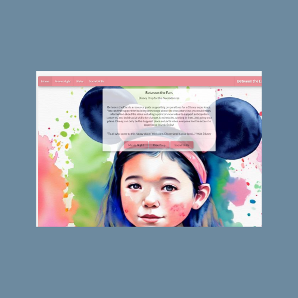
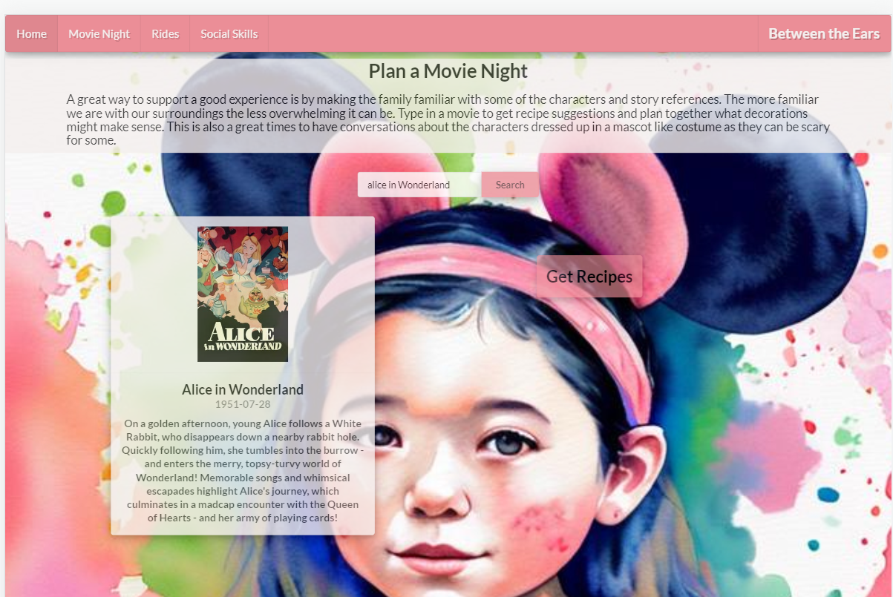
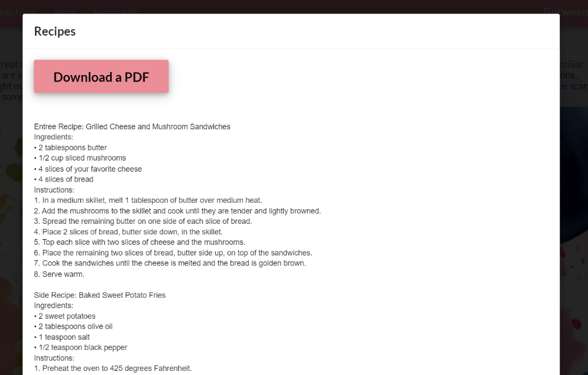
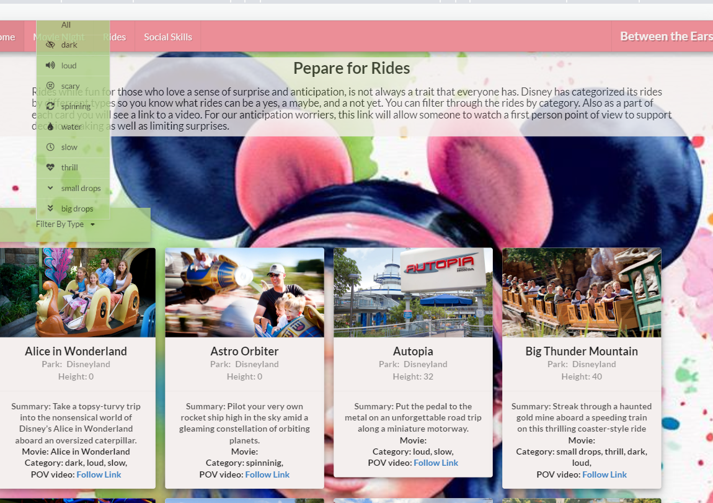
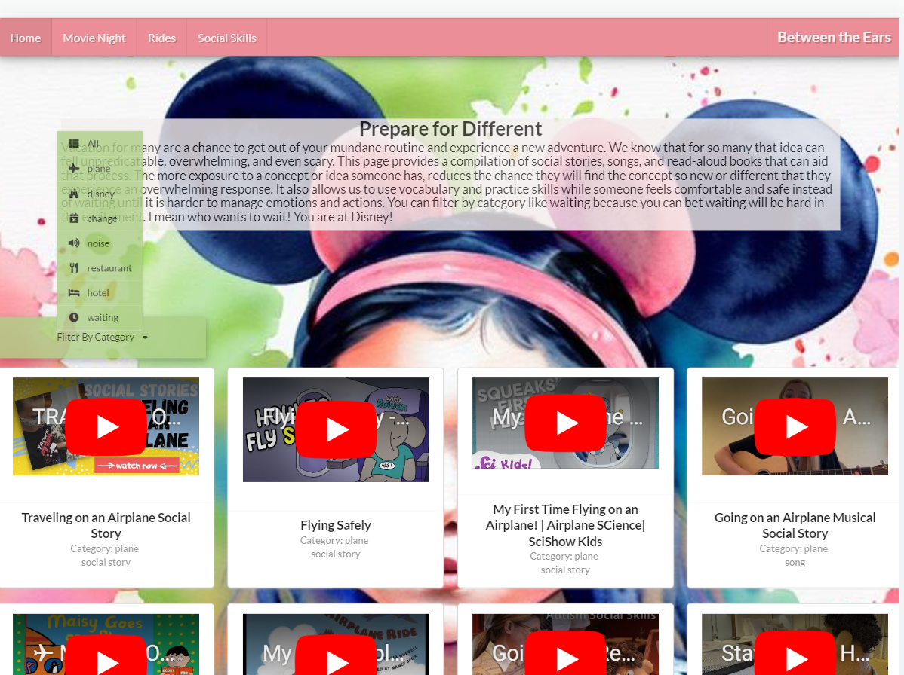

# Between The Ears

## About the Project

This project came about from an individual assignment. We were to make a application that used React and Redux. The idea came organically from my experiences and the told experiences of others. My family and were planning a Disney trip and this will be the first trip for my 3 year old. It occured to me that Disney can be an overwhelming experience and a trip of new experiences like planes rides, hotel stays and security. As a Speech Pathologist I treated and supported many students that would also struggle to regulate in such a trip. In looking for resources to prepare my 3 year old I realized there was a lack of resources that were centralized. Thus came my application Between the Ears. This is a site for young children and the neurodiverse to prepare for a trip. 

## Built With

* React
* Redux
* JavaScript
* CSS
* Semantic UI
* OpenAI

## Usage

To use the site you simply navigate to the page of interest. It allows you to plan a movie night with a search and recipe search:

 categorize and search through possible rides, a POV video of the ride so there are no surprises:
 
 
 
 
  and a social skills page with lots of social stories, songs, and read aloud books.

## Learnings and Challenges

This was a project that was start to finish my concept and work with alot more freedom in our creation. I learned that I really enjoy the creative process and it makes it much easier to work when it is about a project you are passionate about. Inclusivity is a passion of mine and I have already heard such positive feedback from my resources I have gathered. Challenges would definetly be the responsiveness. Unfortunately I did not remember to make this site responsive until after the project was complete. While it ended well it was stress that taught me to plan for responsivness from the beginning.